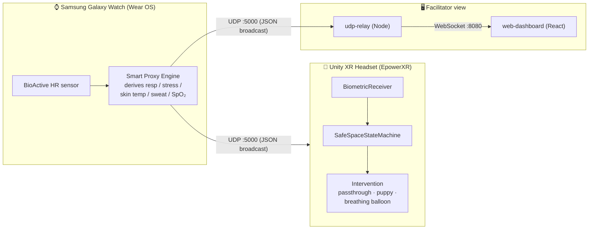

# EmpowerXR — Safe Space

> An open-source, self-contained Unity SDK that autonomously detects sensory
> overstimulation from live biometric telemetry and triggers localized grounding
> interventions in XR.

EmpowerXR Safe Space is a hackathon-built accessibility toolkit for XR. A
smartwatch streams the wearer's heart rate to the headset; an on-device "Smart
Proxy" derives a fuller biometric picture (respiration, stress, skin temperature,
sweat loss, SpO₂); and a Unity state machine watches those signals and, when it
detects the onset of sensory overwhelm, intervenes in real time — softening the
scene, engaging passthrough, and deploying a calming anchor. A companion web
dashboard visualizes the same telemetry for facilitators, clinicians, or
researchers observing a session.

The project is aimed at people building **sensory-safe and neurodivergent-friendly
XR experiences** — and is licensed MIT so it can be adopted and extended freely.

---

## Table of contents

- [What's in this repo](#whats-in-this-repo)
- [How it works (architecture)](#how-it-works-architecture)
- [Run the demo on your own hardware](#run-the-demo-on-your-own-hardware)
- [Repository layout](#repository-layout)
- [Quick start](#quick-start)
- [The biometric contract](#the-biometric-contract)
- [Branch map — where the rest of the project lives](#branch-map--where-the-rest-of-the-project-lives)
- [Project status & maturity](#project-status--maturity)
- [Documentation](#documentation)
- [License](#license)

---

## What's in this repo

| Component | Path | Tech | Role |
|---|---|---|---|
| **Unity XR app** | `EpowerXR/` | Unity 6 (6000.4.1f1), OpenXR, AR Foundation, URP | The headset experience. Receives biometrics over UDP and runs the full demo: a liminal hallway → escalating sensory overload → SDK intervention (puppy + breathing-balloon). |
| **WearOS Bridge** | `apps/WearOS_Bridge/` | Kotlin, Jetpack Compose, Wear OS | Smartwatch app. Reads live heart rate, derives the rest via the Smart Proxy Engine, and broadcasts the biometric packet over UDP. |
| **UDP → WebSocket relay** | `apps/udp-relay/` | Node.js, `ws` | Bridges the LAN UDP biometric stream to browsers over WebSocket. |
| **Web dashboard** | `apps/web-dashboard/` | React 18, TypeScript, Vite, µPlot | Real-time, bilingual (EN/DE) facilitator dashboard with watch faces, live charts, and an SDK-state indicator. |
| **Safe Space SDK** | `packages/com.empowerxr.safespace/` | Unity Package (UPM) | Distributable package scaffold intended to hold the reusable SDK (see [audit](docs/AUDIT.md)). |
| **Sensory Sandbox** | `apps/SensorySandbox/` | Unity | Scaffold on `main`. An earlier standalone "chamber" prototype lives on the `SensorySandbox` branch; the canonical experience now ships inside `EpowerXR`. |

> 🚀 **Want to run it on a real Samsung Galaxy XR + Galaxy Watch Ultra?** Jump to the
> [setup & usage guide](docs/SETUP.md).

---

## How it works (architecture)



1. **Sense.** The watch reads live heart rate from the hardware sensor.
2. **Derive.** The on-watch *Smart Proxy Engine* turns that single live signal into
   a full biometric vector using documented physiological heuristics (see
   [the methodology](docs/ARCHITECTURE.md#4-smart-proxy-methodology)).
3. **Broadcast.** Every 500 ms it broadcasts a JSON packet over UDP on the local
   subnet (port `5000`).
4. **React (headset).** The Unity `BiometricReceiver` listens on UDP `5000`. The
   `SafeSpaceStateMachine` evaluates the signals against thresholds and escalates
   through `baseline → elevated → alert → intervention`, driving passthrough and a
   peripheral vignette.
5. **Observe (web).** In parallel, the Node `udp-relay` receives the same UDP
   stream and re-emits it over WebSocket `8080`; the React dashboard renders live
   watch faces, 5-minute charts, and the current SDK state.

See **[docs/ARCHITECTURE.md](docs/ARCHITECTURE.md)** for the full data flow, the
Smart Proxy formulas, and the state model.

---

## Run the demo on your own hardware

Want to experience the full loop — wear the watch, walk the hallway, feel the
overload, and get grounded by the puppy + breathing balloon — on your own
**Samsung Galaxy XR** headset and **Samsung Galaxy Watch Ultra**?

👉 **Follow the complete step-by-step guide: [How to install / setup / use this
application →](docs/SETUP.md)**

It covers, in order:

1. **Network setup** — getting the watch, headset, and laptop on one Wi-Fi subnet (the #1 thing people get wrong).
2. **Watch app** — setting your broadcast address, enabling Wear OS developer mode, and installing `WearOS_Bridge`.
3. **Headset app** — opening `EpowerXR` in Unity 6, validating the scene, configuring the intervention, and deploying to the Galaxy XR.
4. **Optional dashboard** — the laptop facilitator view.
5. **Running, calibrating, and troubleshooting** the live demo.

> Prefer to just see the data first? The headset-free [Quick start](#quick-start)
> below runs the relay + dashboard on any laptop.

---

## Repository layout

```
empowerxr-safe-space/
├── EpowerXR/                       # Unity 6 XR application (the headset experience)
│   └── Assets/
│       ├── Scenes/SampleScene.unity   # The assembled demo (hallway → overload → intervention)
│       ├── Scripts/                   # Safe Space runtime logic
│       │   ├── BiometricReceiver.cs       # UDP listener + JSON parsing
│       │   ├── SafeSpaceStateMachine.cs   # Overwhelm detection + intervention (puppy / object-swap)
│       │   ├── VignetteController.cs      # HR-driven peripheral vignette (URP)
│       │   ├── PassthoughController.cs    # AR passthrough toggle
│       │   ├── BiometricDebugUI.cs        # On-screen telemetry readout (TMP)
│       │   ├── RandomLightFlicker.cs      # Liminal "light chaos" ambience
│       │   ├── DriftingRotation.cs        # Unsettling slow drift
│       │   └── GazeFollower.cs            # Gaze-reactive elements
│       ├── SandboxEffects/            # Arc-flash / echo-chamber overstimulation controllers
│       ├── 3D model/                  # Puppy, liminal-space hallway, etc.
│       └── Audio/                     # Breathing-balloon (inhale/exhale) + harsh stress audio
├── packages/
│   └── com.empowerxr.safespace/    # UPM package (SDK distributable — scaffold)
├── apps/
│   ├── WearOS_Bridge/             # Wear OS broadcaster (Kotlin/Compose) — full app
│   ├── udp-relay/                 # UDP → WebSocket bridge (Node)
│   ├── web-dashboard/             # React/Vite facilitator dashboard
│   └── SensorySandbox/            # Scaffold (earlier prototype on the SensorySandbox branch)
├── docs/                          # SETUP, ARCHITECTURE, AUDIT
├── LICENSE                        # MIT
└── README.md
```

---

## Quick start

> For the **full hardware demo** (Galaxy XR + Galaxy Watch Ultra), use the
> [setup & usage guide](docs/SETUP.md). The steps below are the **headset-free**
> path — run the relay + dashboard on any laptop to see the data flow.

You can run the **web stack** (relay + dashboard) on any machine with Node 18+ and
a browser, with no headset or watch required — it will display live data the moment
a biometric source starts broadcasting on UDP `5000`.

### 1. Run the relay + dashboard

```bash
# Terminal 1 — UDP→WebSocket relay (listens UDP :5000, serves WS :8080)
cd apps/udp-relay
npm install
npm start

# Terminal 2 — web dashboard (Vite dev server)
cd apps/web-dashboard
npm install
cp .env.example .env        # VITE_WS_URL=ws://localhost:8080
npm run dev                 # open the printed http://localhost:5173
```

> No watch handy? The dashboard's **Smart Proxy** also runs client-side: send any
> packet containing at least `hr` to UDP `5000` and the derived metrics fill in.

### 2. Open the Unity app

1. Install **Unity 6 (6000.4.1f1)** with Android / OpenXR build support.
2. Open the `EpowerXR/` folder as a project.
3. Open `Assets/Scenes/SampleScene.unity`.
4. Ensure UDP `5000` is allowed inbound through the host firewall.
5. Press Play (or build to an Android XR device). The `BiometricReceiver` begins
   listening immediately.

### 3. Build the watch app

The full Wear OS broadcaster now lives on `main` under `apps/WearOS_Bridge/`.

```bash
cd apps/WearOS_Bridge
./gradlew installDebug      # deploy to a paired Wear OS 3+ device
```

Set `BROADCAST_ADDRESS` in `MainActivity.kt` to your LAN's subnet broadcast
address (e.g. `192.168.8.255`) before building. Full instructions, including
network setup and developer-mode pairing, are in the
[setup guide](docs/SETUP.md#5-step-2--install-the-watch-app-galaxy-watch-ultra).

> **No packaged build (APK/AAB) is committed** — Android binaries are intentionally
> git-ignored. Adopters build from source as above. See the
> [submission notes](docs/AUDIT.md#packaging--distribution).

---

## The biometric contract

All components speak a small JSON packet over UDP `5000`. The watch broadcasts it;
the headset and relay consume it. Field names currently differ slightly between
producers and consumers — **this is a known integration gap, documented in the
[audit](docs/AUDIT.md#1-biometric-field-name-mismatch-across-the-wire).**

```jsonc
// Emitted by the Wear OS bridge every 500 ms:
{ "hr": 92, "resp": 23, "stress": 48, "sweat_ml": 1.5, "skin_temp": 36.9, "spo2": 98 }
```

| Field | Unit | Source | Notes |
|---|---|---|---|
| `hr` | bpm | **live** | Hardware heart-rate sensor |
| `resp` | br/min | derived | `clamp(HR / 4, 12, 30)` |
| `stress` | 0–100 | derived | State machine: +2/tick above HR 85, decays toward 30 |
| `sweat_ml` | ml | derived | Accumulates +0.5/tick only above HR 110 |
| `skin_temp` | °C | derived | Constrained random walk, clamped 36.1–37.4 |
| `spo2` | % | derived | Random 97–99% (simulated) |

> ⚠️ Only **heart rate is a real sensor reading.** Every other value is a
> physiologically-plausible *estimate* derived from HR — clearly labeled "Smart
> Proxy" / simulated throughout the UI. This is a demonstration system, **not a
> medical device.**

---

## Branch map — where the rest of the project lives

`main` is now the **complete, integrated project** — the Unity experience, the Wear OS
app, the relay, and the dashboard. The remaining branches are history/prototypes kept
for reference.

| Branch | Contents | Status |
|---|---|---|
| `main` | Full experience (EpowerXR) + WearOS app + udp-relay + web-dashboard | ✅ canonical |
| `feature/wear-os-udp` | The Wear OS Smart Proxy broadcaster | ✅ merged into `main` |
| `Imad` | The assembled experience — liminal hallway, light chaos, puppy + breathing-balloon intervention, particle packs | ✅ merged into `main` (curated) |
| `SensorySandbox` | Earlier standalone "chamber" prototype (Baseline / Arc Flash / Echo Chamber) in `Assets/Sandbox/` | 🗂️ kept as reference — superseded |
| `SensorySandboxSequel` | A retune of that prototype (strobe/stress tuning, shorter chamber 2) | 🗂️ kept as reference — superseded |
| `web-dashboard` | The dashboard | ✅ merged into `main` (PR #2) |
| `feature/intervention-hooks`, `feature/unity-telemetry` | Empty / no diff vs `main` | 🗑️ stale |

> The `SensorySandbox`/`Sequel` branches were intentionally **not** merged — they are
> a separate earlier take on the overstimulation chambers and would conflict with the
> assembled experience now on `main`. See [docs/AUDIT.md](docs/AUDIT.md) for the
> branch analysis.

---

## Project status & maturity

This is a **hackathon prototype** — a working end-to-end vertical slice, not a
production SDK. Honest summary:

- ✅ **Works end-to-end** across watch → headset → dashboard, now integrated on a
  single `main` branch.
- ✅ Web dashboard and relay are clean, documented, and ready to run.
- ✅ Repo cleaned up: feature branches consolidated, committed build junk
  (`.utmp/`, `_Recovery/`, `.rar`) purged and git-ignored.
- ⚠️ The advertised "self-contained Unity SDK" package
  (`packages/com.empowerxr.safespace`) is still an **empty scaffold**; the runtime
  logic lives in `EpowerXR/Assets/Scripts/`.
- ⚠️ A **field-name mismatch** on the UDP wire means the Unity headset reads
  heart rate but not `stress`/`sweat` from the watch (the demo is HR-driven; a
  one-line fix is in the [setup guide](docs/SETUP.md#known-headset-only-reads-heart-rate-stresssweat-show-0)).
- ℹ️ The merged Unity scene should be **opened once in Unity 6 to validate** there
  are no missing references before a showcase build.

A complete, prioritized engineering review — with severity ratings and concrete
fixes for anyone adopting the project — is in **[docs/AUDIT.md](docs/AUDIT.md)**.

---

## Documentation

| Document | Purpose |
|---|---|
| **[docs/SETUP.md](docs/SETUP.md)** | **How to install / setup / use this application** — end-to-end guide for running the demo on a Galaxy XR headset + Galaxy Watch Ultra, with calibration and troubleshooting. |
| **[docs/ARCHITECTURE.md](docs/ARCHITECTURE.md)** | Data flow, component responsibilities, Smart Proxy methodology, state model, ports & protocols. |
| **[docs/AUDIT.md](docs/AUDIT.md)** | Full engineering audit: completeness, integration gaps, code quality, security/privacy, and an adoption roadmap. |

---

## License

[MIT](LICENSE) © 2026 Ali Daniali / EmpowerXR. Free to use, modify, and extend.
