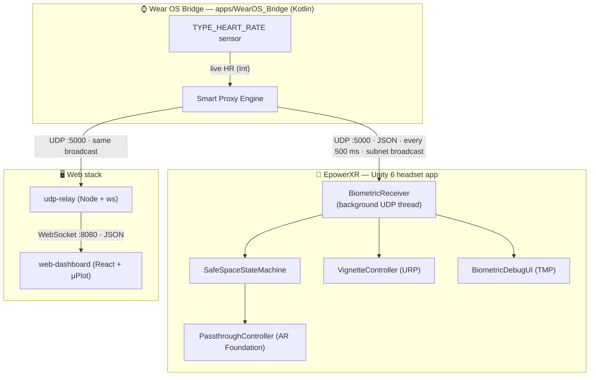
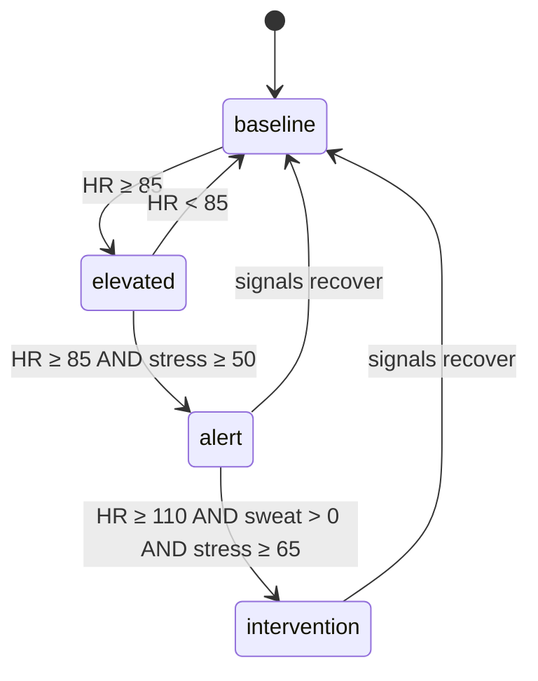

# Architecture

This document describes how EmpowerXR Safe Space is put together: the components,
the data that flows between them, the protocols and ports, the Smart Proxy
methodology, and the intervention state model.

---

## 1. System overview

Safe Space is a distributed, four-process system connected by a single small
biometric packet that hops across the local network.



Two consumers read the **same UDP broadcast independently**:

- The **headset** (`EpowerXR`) — to drive the in-world intervention.
- The **relay** (`udp-relay`) — to forward telemetry to browsers for observation.

This decoupling means the facilitator dashboard works even if no headset is
present, and the headset works even if no dashboard is open.

---

## 2. Components & responsibilities

### 2.1 Wear OS Bridge — `apps/WearOS_Bridge/` *(branch `feature/wear-os-udp`)*

A single-activity Jetpack Compose Wear OS app.

- Requests `BODY_SENSORS` permission and registers a `TYPE_HEART_RATE`
  `SensorEventListener`.
- Runs a coroutine on `Dispatchers.IO` that, every `BROADCAST_INTERVAL_MS`
  (500 ms), reads the latest HR, runs the **Smart Proxy Engine** (§4), and sends a
  JSON `DatagramPacket` to the subnet broadcast address on port `5000`.
- Renders a small live readout on the watch face.

Key constants (`MainActivity.kt`):

| Constant | Value | Meaning |
|---|---|---|
| `BROADCAST_ADDRESS` | `192.168.8.255` | Subnet broadcast address — **must match the deployment LAN** |
| `BROADCAST_PORT` | `5000` | UDP port |
| `BROADCAST_INTERVAL_MS` | `500` | Emission cadence |

Build target: `minSdk 30` (Wear OS 3+), `compileSdk 34`, Kotlin 1.9.24, JVM 17.

### 2.2 EpowerXR Unity app — `EpowerXR/`

Unity 6 (`6000.4.1f1`), Universal Render Pipeline, OpenXR + AR Foundation
(`com.unity.xr.androidxr-openxr`), XR Interaction Toolkit, XR Hands.

| Script | Responsibility |
|---|---|
| `BiometricReceiver.cs` | Opens a `UdpClient` on port `5000` on a background thread; deserializes each packet into a `BiometricData` and exposes the latest values as public fields. |
| `SafeSpaceStateMachine.cs` | Each frame, compares `heartRate` / `stressLevel` against thresholds; latches an "overwhelmed" state and toggles AR passthrough on entry/exit (with hysteresis). |
| `VignetteController.cs` | Maps HR `60→120 bpm` onto a URP `Vignette` intensity `0→0.8` for a continuous peripheral-softening effect. |
| `PassthoughController.cs` | Standalone demo toggle that flips passthrough after 5 s (illustrative). |
| `BiometricDebugUI.cs` | Renders all six metrics to a TextMeshPro overlay for debugging. |

> The reusable SDK is *intended* to live in `packages/com.empowerxr.safespace`
> (`Runtime/` + `Editor/`), but those folders currently contain only `.gitkeep`
> placeholders. The logic above is the de-facto SDK. See
> [AUDIT.md](AUDIT.md#2-the-sdk-package-is-an-empty-scaffold).

### 2.3 Sensory Sandbox — `apps/SensorySandbox/` *(branch `SensorySandbox`)*

A demo "host application" that consumes the SDK and deliberately induces
overstimulation so the intervention can be demonstrated. It runs an orchestrated
sequence of **chambers**:

| Chamber | Controller | Stimulus |
|---|---|---|
| 1 — Baseline | `BaselineController` | Calm, evenly-lit room (ambient intensity 1.8) |
| 2 — Arc Flash | `ArcFlashController` | Room dims to black while neon emissive primitives orbit and strobe (`flashInterval` 0.1 s) |
| 3 — Echo Chamber | `EchoChamberController` | Walls close in over 20 s while spatial harsh-audio sources ramp to full volume |

`SandboxManager` sequences the chambers with timed lead-in warnings (`WarningUI`),
`OrbitBehavior` handles floor-aware orbital motion, and `TestChamberButton` exposes
per-chamber `[ContextMenu]` triggers for testing in the editor.

The sandbox references the SDK package by relative path in its
`Packages/manifest.json`:

```json
"com.empowerxr.safespace": "file:../../../packages/com.empowerxr.safespace"
```

### 2.4 UDP → WebSocket relay — `apps/udp-relay/`

A ~160-line Node service (`index.js`, ESM, dependency: `ws`).

- Binds a `udp4` socket to `0.0.0.0:5000` with `SO_REUSEADDR` and broadcast enabled.
- Parses incoming datagrams as JSON, falling back to `key=value,key=value` pairs.
- **Normalizes** heterogeneous field names into one canonical shape (§3.2).
- Stamps each reading with `timestamp: Date.now()` and fan-outs to all connected
  WebSocket clients on port `8080`.
- Logs to stdout and to `logs/relay-<timestamp>.log`; handles `SIGINT`/`SIGTERM`
  for graceful shutdown.

Configurable via env vars: `UDP_PORT` (5000), `WS_PORT` (8080).

### 2.5 Web dashboard — `apps/web-dashboard/`

React 18 + TypeScript + Vite, charting with µPlot. Bilingual EN/DE throughout.

| Module | Role |
|---|---|
| `hooks/useWebSocket.ts` | Connects to the relay, auto-reconnects every 3 s, parses readings. |
| `hooks/useSlidingWindow.ts` | Keeps a rolling 10-minute window of readings in state. |
| `proxy/smartProxy.ts` | A **client-side mirror of the Smart Proxy** — fills any `null` field so the dashboard shows a complete picture even when the source sends only HR. |
| `components/WatchFace/` | Per-metric "watch face" tiles with live/derived badges and status. |
| `components/MetricsGraph/` | Six synchronized 5-minute µPlot time-series charts. |
| `components/SdkStateIndicator/` | Recomputes the SDK state (`baseline`/`elevated`/`alert`/`intervention`) from the latest reading and shows active triggers — a UI mirror of the Unity state machine. |
| `components/MethodologyDrawer/` | Expandable, fully-documented explanation of every Smart Proxy formula. |

Config: `VITE_WS_URL` (default `ws://localhost:8080`) via `.env`.

---

## 3. The wire protocol

### 3.1 Transport

- **UDP, port 5000**, JSON payload, subnet broadcast, ~2 Hz (every 500 ms).
- Stateless and connectionless — any number of consumers can listen; lost packets
  are simply skipped (acceptable for a continuously-refreshed telemetry stream).

### 3.2 Field names (and the known mismatch)

Three producers/consumers describe the same six metrics with **slightly different
keys**. The relay reconciles them; the Unity receiver does not yet. This is the
single most important integration issue for adopters — see
[AUDIT.md §1](AUDIT.md#1-biometric-field-name-mismatch-across-the-wire).

| Metric | Wear OS emits | Unity expects | Relay canonical (→ dashboard) |
|---|---|---|---|
| Heart rate | `hr` | `hr` | `hr` |
| Respiration | `resp` | `resp` | `resp` |
| Stress | `stress` | `stress_level` ⚠️ | `stress` |
| Sweat | `sweat_ml` | `sweat_loss` ⚠️ | `sweatLoss` |
| Skin temp | `skin_temp` | `skin_temp` | `skinTemp` |
| SpO₂ | `spo2` | `spo2` | `spo2` |

The relay's `normalise()` accepts many aliases (`hr|heartRate`,
`stress|stress_level|stressLevel`, etc.), which is why the dashboard works. The
Unity `BiometricData` struct uses fixed names, so `stress_level` and `sweat_loss`
silently stay `0` when fed the watch's packet.

---

## 4. Smart Proxy methodology

Only **heart rate is measured.** Every other metric is derived from HR using
documented, physiologically-motivated heuristics. The same model is implemented
twice: authoritatively on the watch (`MainActivity.kt`) and as a client-side
fallback in the dashboard (`smartProxy.ts`).

| Metric | Formula | Rationale |
|---|---|---|
| **Respiration** | `clamp(HR / 4, 12, 30)` br/min | Cardiac–respiratory coupling; clamped to the normal resting range. |
| **Stress** | init `30`; `if HR > 85: +2/tick` toward 100; else decay toward 30 | Incremental autonomic-arousal state machine with directional lag (build-up/recovery). |
| **Skin temp** | init `36.8 °C`; `±0.1 °C` random walk, clamp `36.1–37.4` | Micro-fluctuations of resting surface thermoregulation. |
| **Sweat loss** | init `0 ml`; `if HR > 110: +0.5/tick`; never decreases | Threshold accumulator — perspiration requires sustained exertion; fluid loss is cumulative. |
| **SpO₂** | `97 + round(rand()·2)` → 97–99% | Plausible resting blood-oxygen fluctuation (fully simulated). |

> **Implementation note:** the stress *decay* rule differs between the two
> implementations — the watch decays by 5% of the excess above 30 per tick, while
> the dashboard/methodology text decays by a flat 0.5/tick. Functionally similar,
> but worth aligning. See [AUDIT.md §6](AUDIT.md#6-smart-proxy-divergence-between-implementations).

---

## 5. Intervention state model

The escalation ladder, as implemented in the dashboard's `SdkStateIndicator`
(which documents the intended SDK behavior) and approximated by the Unity
`SafeSpaceStateMachine`:



| State | Trigger | SDK response |
|---|---|---|
| **Baseline** | all signals normal | Passive monitoring |
| **Elevated** | HR ≥ 85 | Passive visual softening (vignette begins) |
| **Alert** | HR ≥ 85 **and** stress ≥ 50 | Colour lens + peripheral vignette engaged |
| **Intervention** | HR ≥ 110 **and** sweat > 0 **and** stress ≥ 65 | Passthrough forced; grounding anchor deployed |

The Unity `SafeSpaceStateMachine` currently implements a simpler two-state version
(overwhelmed if `HR > 77` **or** `stress > 70`; recovers when `HR < 77` **and**
`stress < 50`), toggling AR passthrough. The richer four-state ladder above is the
documented target the dashboard already reflects.

---

## 6. Ports, protocols & configuration summary

| Concern | Value | Where to change |
|---|---|---|
| Biometric UDP port | `5000` | `MainActivity.kt` (`BROADCAST_PORT`), `BiometricReceiver.cs` (`port`), `udp-relay` (`UDP_PORT`) |
| Watch broadcast address | `192.168.8.255` | `MainActivity.kt` (`BROADCAST_ADDRESS`) |
| Relay WebSocket port | `8080` | `udp-relay` (`WS_PORT`) |
| Dashboard WS URL | `ws://localhost:8080` | `web-dashboard/.env` (`VITE_WS_URL`) |
| Broadcast cadence | 500 ms | `MainActivity.kt` (`BROADCAST_INTERVAL_MS`) |
| HR overwhelm threshold (Unity) | `77 bpm` | `SafeSpaceStateMachine.cs` (`heartRateThreshold`) |

---

## 7. Toolchain versions

| Tool | Version |
|---|---|
| Unity | 6000.4.1f1 (Unity 6) |
| URP | 17.4.0 |
| OpenXR | 1.16.1 |
| AR Foundation (Android XR OpenXR) | 1.3.1 |
| XR Interaction Toolkit | 3.4.1 |
| Node.js | 18+ (ESM, top-level await not required) |
| React / Vite / TypeScript | 18.3 / 5.3 / 5.5 |
| Wear OS Gradle / AGP / Kotlin | AGP 8.13.2 / Kotlin 1.9.24 / JVM 17 |
